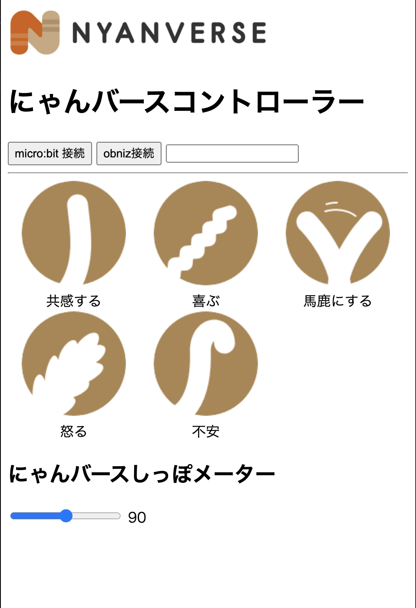

# にゃんバースコントローラー

- Chrome/Edge推奨
- Serial APIでmicro:bitの傾きを検知

### 使い方

1. obnizサーボモータにしっぽを接続
1. micro:bit接続ボタンクリック
1. ダイアログに従いシリアル接続
1. テキストフィールドにobnizのIDを入力
1. obniz接続ボタンをクリック
1. 以下としっぽ＆にゃんバースしっぽメーターが連動する
    - micro:bitの傾き
    - 5種類のボタンをクリック

## microbit
- micro:bitのプログラム
- 転送してUSBでつないでおく
- 傾きを200ms毎にシリアルで送信
